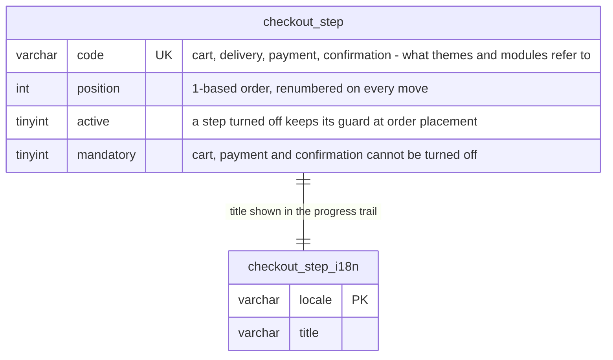

Data model

One table and its i18n companion, seeded with the four historical steps, plus
the `checkout_display_mode` config key (`steps`, the default, or `one_page`).

The rows carry the merchant's choices (order, activation, wording). What a
step *does* — its guard, whether a cart may skip it, which component a theme
might render it with — lives in code, on a `CheckoutStepProviderInterface`
service tagged `thelia.checkout.step_provider`. A module adds a step by
shipping one such service; the row appears on the back-office screen at the
next visit through the synchronize event. A row whose provider is gone
(uninstalled module) is kept but excluded from the tunnel.

`componentName()` is a hint and nothing more. The four core providers answer
`null`: naming a component is the theme's business, and the theme maps the core
codes itself (`componentFor(code) ?? $step->componentName`). A module shipping a
step no theme has heard of is where the hint earns its place.

Titles are resolved in one place, `CheckoutStepTitleResolver::titleOf(step,
?locale)`: asked locale, then shop language, then any locale actually written,
then the code — never the `DEFAULT TITLE` placeholder `I18n` forges.
