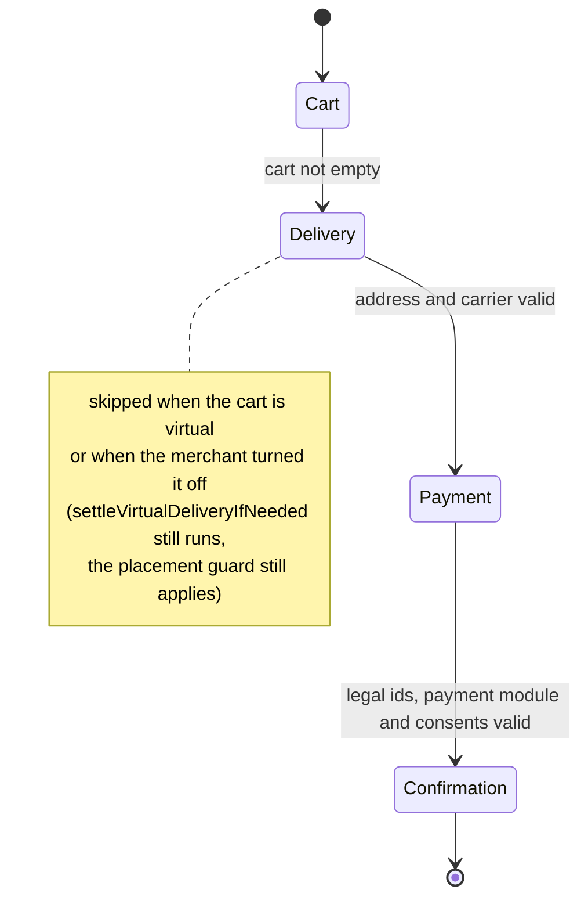

Progression

`CheckoutProgressionService` is the single authority on where a cart stands:

- `activeSteps(Cart, ?locale)` — the ordered active steps, minus the ones the
  cart skips (a virtual cart skips delivery);
- `firstIncompleteStep(Cart)` — the first step whose guard throws;
- `isReachable(Cart, code)` — whether every step before `code` passes.

It never reads the session: the cart is always passed in, so the CLI and the
front API (#116) consume it the same way the theme does. The one indirect
session read left — the payment step checks the buyer's consents — goes
through `ConsentAcceptanceReaderInterface`, whose default implementation is
the session store; a sessionless consumer swaps the reader instead of the
service. Results are memoised per cart *and per state of that cart* for the
request — the key carries the cart timestamp and the choices made on it, so a
saved change invalidates itself; `forget()` remains for what the key cannot see
(a step row that moved, a consent toggled) and `kernel.reset` for persistent
runtimes. The tunnel shape rule — cart first, payment next to last,
confirmation last — lives in `CheckoutTunnelShape`, shared by the read-side
fallback and the write-side refusals, and `CheckoutStepQuery::orderedByTunnel()`
is the one ordering (position, then code) every reader of the table uses.

A cart with nothing to ship skips the delivery step on screen and still needs
the carrier the order cannot be placed without:
`CheckoutFacade::settleVirtualDeliveryIfNeeded(Cart)` settles it, once, and
does nothing to any other cart. The rule is the core's, not a theme's.

The theme asks `isReachable()` before serving a step page and redirects to the
first incomplete step otherwise — no more per-exception redirect maps. In the
one-page form the same steps are stacked in an accordion — the theme's own
Accordion molecule, in its documented h4 variant — and the screen carries no
progress trail: the sections themselves say what is settled and what is left.
A locked section is an unrendered section, and unlocking is display only: the
refusal at placement stays on the server.

Two deliberate trade-offs in the theme. The next-step button re-renders on
every live event, so it settles for cheap column reads over the active step
list instead of running the guards — a full `firstIncompleteStep()` would ask
the carrier for a postage quote on every ticked box. And the confirmation
page draws its trail from the step codes snapshotted at placement, because
the cart it would otherwise read has just been emptied and would put the
skipped delivery step back on screen.
