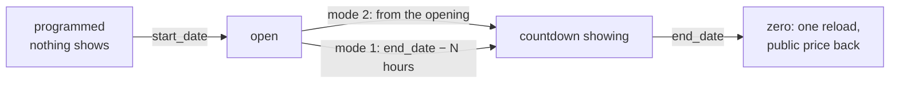

Countdown

The decision is made on the server (`Sale::shouldDisplayCountdown()`): never
without an end date, never before the start date. What reaches the browser is a
remaining duration in seconds, not a date, so a wrong local clock cannot show a
negative countdown. The theme counts down on a monotonic clock
(`performance.now()`), one shared interval per page, resyncs when a throttled
background tab becomes visible again, and reloads once at zero. Closing the
sale (price back to normal) remains the job of the `sale:check-activation`
cron, as for every public sale.
