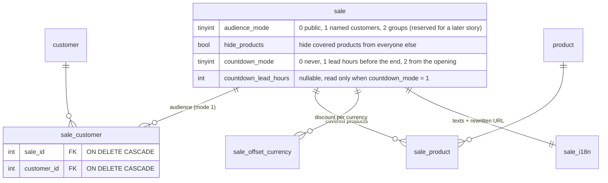

Data model

Two things changed in the schema: four settings columns on `sale`, and the
`sale_customer` link table. The reserved price is deliberately absent from this
model — see the next section.

Both foreign keys cascade: deleting the last targeted customer (a GDPR purge,
for instance) silently empties the audience. The back office list therefore
shows the recipient count on every reserved sale and turns it into an alert at
zero. The `(active, audience_mode)` index carries the "is any reserved sale
running" short-circuit that keeps shops without reserved sales on their
historical query plans.

`audience_mode = 2` (customer groups) is modeled but not implemented: customer
groups do not exist in the core yet.
