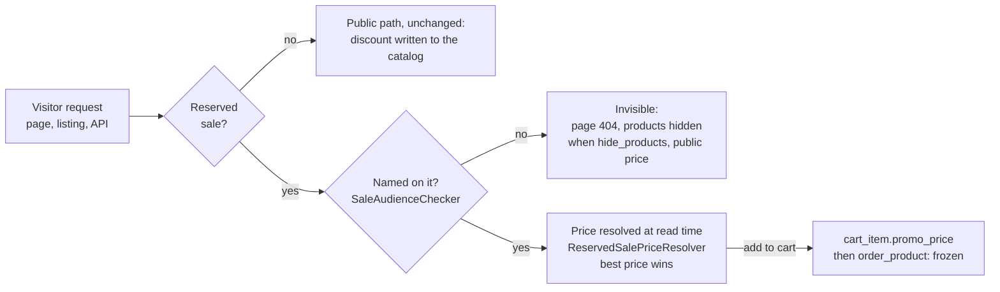

Where the reserved price lives

A public sale writes its discount into the catalog
(`product_sale_elements.promo`, `product_price.promo_price`) when it activates.
A reserved sale never does: those two columns are what every visitor sees. Its
price is resolved at read time, for entitled customers only, and is only
persisted once the customer acts on it.

The moving parts, all under `Thelia\Domain\Sale`:

- `SaleDiscountCalculator` — the taxed-offset formula (taxed price, minus the
  offset, back to untaxed), extracted so the written path (`Action\Sale`) and
  the resolved path share one implementation to the cent.
- `SaleAudienceChecker` — is this customer named on that sale; is any reserved
  sale running. Memoized per request (`ResetInterface`).
- `ReservedSalePriceResolver` / `ReservedSalePriceCatalog` — batch resolution;
  the catalog memoizes the visitor's whole entitled set once per request so a
  listing costs no query per card.
- `ReservedSaleVisibility` — the single owner of the hiding rule, applied by the
  product loops, the front API extensions, the product view check and the theme
  sitemap. A product covered by two hidden sales stays visible to a customer
  named on either one.
- `CurrentCustomerProvider` — the visitor, read from the session first (the
  theme calls the API in process, where the token storage is empty), then from
  the JWT token storage (direct `/api/front` calls). Guest accounts are never
  entitled: a guest row is reusable by e-mail.

Entitlement is re-evaluated on every request, and the cart re-resolves on
login, on change and on restore: a customer who loses the right falls back to
the public price at the next cart refresh. An order keeps the price it was
placed at (`order_product.promo_price`, `was_in_promo`) — that is the proof of
the granted price.

The shared data-access cache would leak a per-customer price, so the
`/api/front/products` and `/api/front/product_sale_elements` prefixes bypass it
while a reserved sale is running — and only then. `/api/front/sales` is never in
the shared cache.
